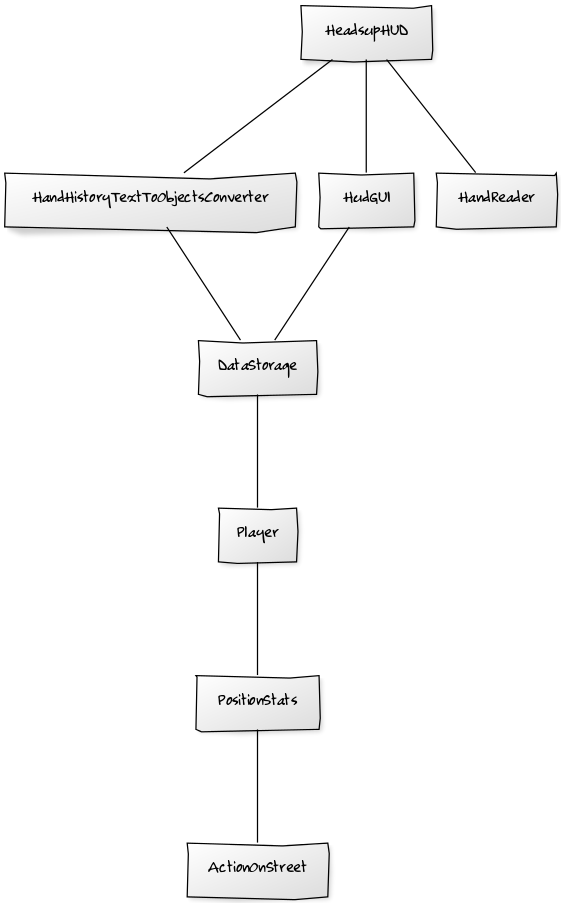
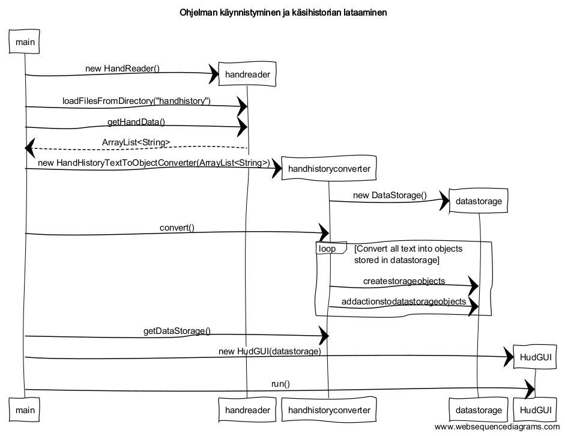

**Aihe:** Toteutetaan Texas Holdem Headsup SitnGo pelejä varten oleva HUD, eli Head-Up Display.

**Taustatietoa:** Texas Holdem Headsup on 1v1 pelimuoto. SitnGo on turnaustyyppinen pelimuoto, pelaajat ostavat itsensä sisään ja saavat saman määrän alkuchippejä. Alkupanoksen koko kasvaa koko ajan ajan edetessä, voittaja saa tyypillisesti 1,8 kertaa sisäänostosumma. Olemassa on jo vastaavia ohjelmia, muttei mitään näin spesifiä.

**Käyttäjät:** Texas Holdem Headsup SitnGo pelejä pelaavat. Pelaajat voisivat käyttää tätä aputyökaluna pelinsä kehittämisessä.

**Toiminnot:**
* Käsien lukeminen tekstitiedostoista yksinkertaiseen tietokantaan käseittäin
  * Tulee lukea vain uudet tekstitiedostot, ei saa tuoda vanhaa tietoa toiseen kertaan tietokantaan
* Erilaisen statistiikan / mittareiden laskeminen
  * preflop fold prosentti
  * preflop call prosentti
  * preflop bet prosentt
  * preflop reraise prosentti
* Ylläolevien mittareiden laskeminen kaikille streeteille, flopille, turnille ja riverille.
* Statistiikan esittäminen graafisena muotona

**Jatkolaajennusmahdollisuuksia:**
* Graafinen preflop käsivahvuustaulukko preflop käsirangen suunnittelun avuksi
* Muiden mittareiden laskeminen kuten donk-bet ja check-raise prosentit
* Pelaajan tyypillisimpien heikkouksien indikoiminen statistiikan perusteella.
* Käyttäjälle mahdollisuus luoda itse omia indikaattoreita?

**Ensimmäinen Luokkakaavio**

**Viimeinen versio Luokkakaavio**

**Rakennekuvaus**

Viimeisimpään luokkakaavioon on tullut paljon muutoksia, ylimääräisiä luokkia on poistettu paljon ja ohjelman rakenne on selkeytynyt. Ohjelmaa ajettaessa HeadsupHUD toimii main luokkana. HeadsupHUD luokka luo Handreaderin, HudGUI:n ja HandHistoryTextToObjectConverterin. Handreader lukee käsihistoriatiedot tekstitiedostosta, converter muuttaa tiedot objektimuotoon, jolloin tietoa pystyy käsittelemään ja hakemaan statistiikkaa tiedosta. Objektit tallennetaan Datastorageen. Tietoa halutaan hakea pelaajan, position, ja streetin mukaan, joten Datastoragen "alta" löytyy luokka jokaiselle osa-alueelle. HudGUI hakee statistiikkaa Datastoragesta ja näyttää sitä käyttäjälle käyttäjän valintojen mukaan.

**Sekvenssikaavio 1: Käyttäjä hakee statistiikkaa hudGUI valinnoilla**

**Sekvenssikaavio 2: Ohjelman käynnistäminen ja käsihistorianlataaminen**

